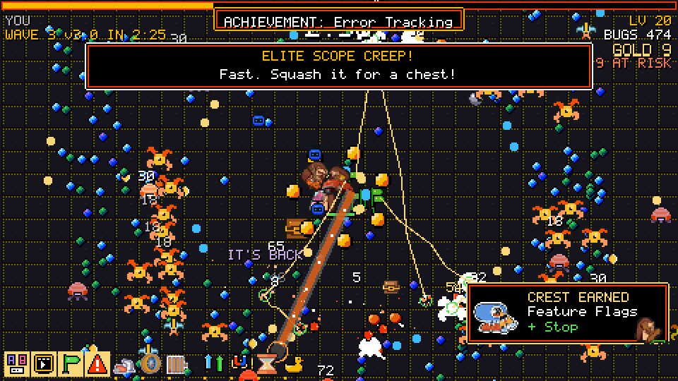
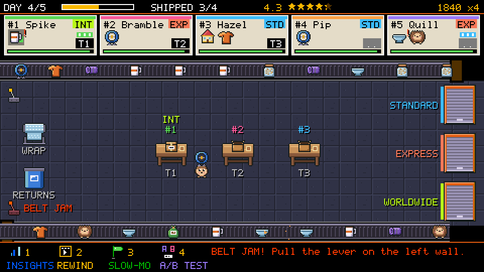
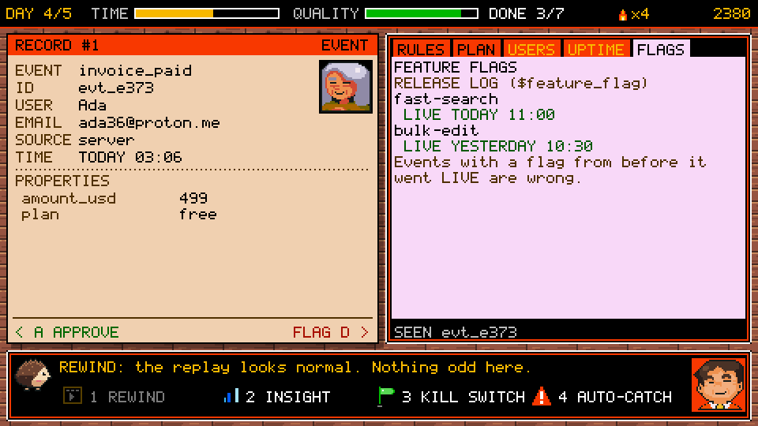
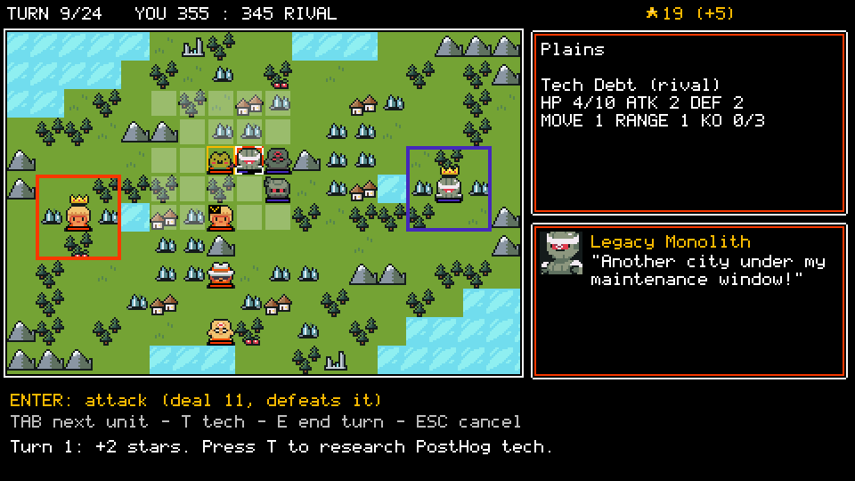
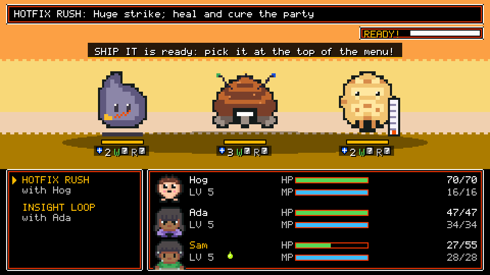
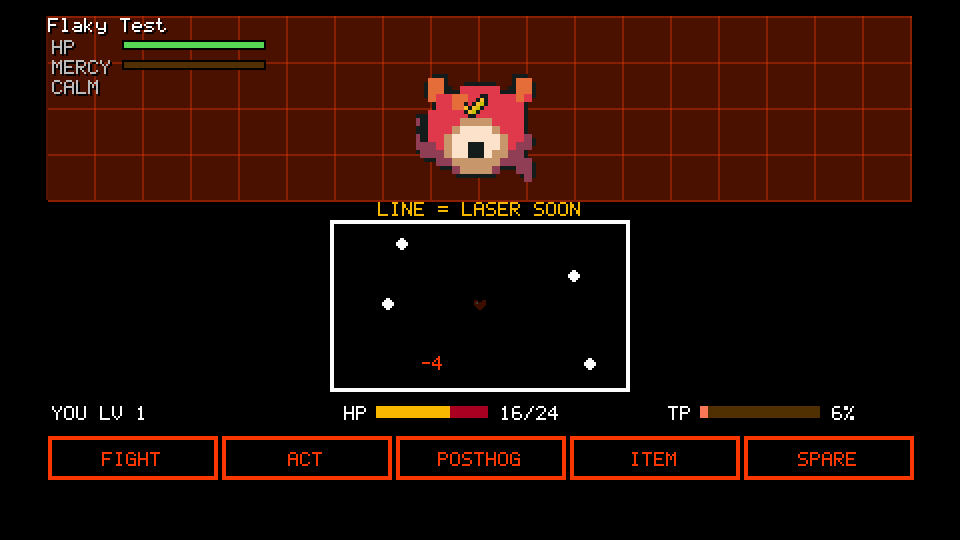
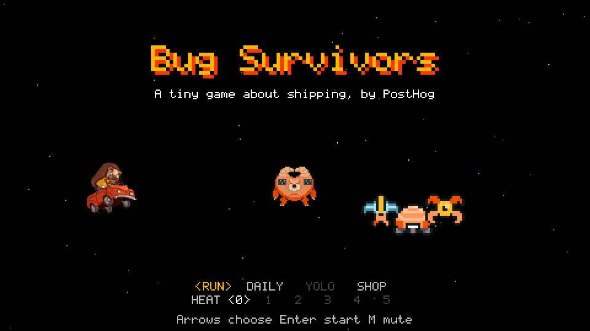
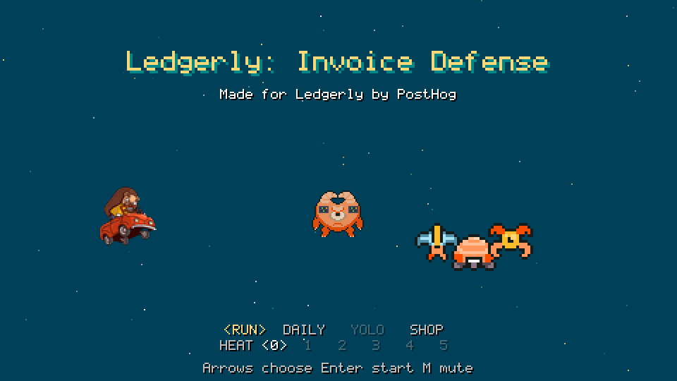
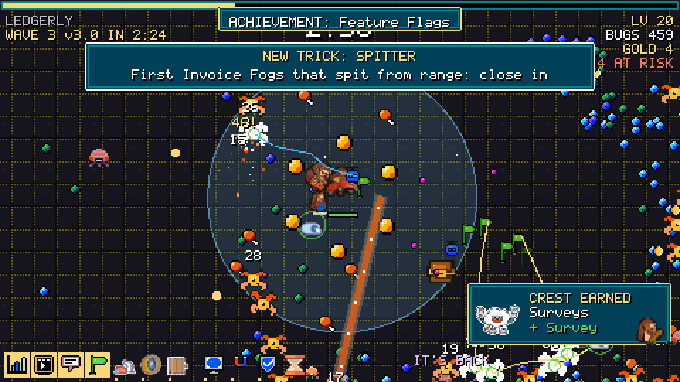

# Prospect Games

Tiny 8-bit browser games that re-skin themselves for a company: its name, brand colours, its own
problems as the enemies, and PostHog products as the power-ups. Six game templates, each tested once,
then turned into a custom game for any company in minutes by Claude. No code changes per company.

**▶ Play the samples: [play.funglass.es](https://play.funglass.es)**

| | |
|---|---|
|  |  |
| **Bug Survivors**: survive swarms of bugs named after the company's pains; every weapon is a PostHog product. Every boss is a release: cash out, or climb the wave ladder for 15 PostHog tools, 171 hoggies to unlock and 55 crests. | **HogShop**: run the back room of a shop; pack orders off conveyor belts and ship them to the right door before customers lose patience. |
|  |  |
| **Data Inspector**: approve or flag the company's events against a growing rulebook (Papers, Please style). | **Hogtopia**: a small 4X strategy game; grow cities and out-research a rival named after the company's biggest problem. |
|  |  |
| **Hog Saga**: a JRPG; a party of three beats the company's problems with PostHog skills. | **Hog Quest**: an Undertale-style office RPG where the best ending is understanding every problem, not fighting it. |

## One template, any company

The same game with its default theme, and re-skinned for Ledgerly (a fictional fintech): name, colours,
the bugs' names and banners, the products on offer and the ending all come from a theme file.

| Default | For Ledgerly |
|---|---|
|  |  |
|  |  |

## The templates

| Template | Game | Player does | Good for |
|---|---|---|---|
| `bug-survivors` | Vampire Survivors-like, ~4 min (then as many waves as you survive) | dodge, level up, pick PostHog products as weapons | engineers, CTOs |
| `data-inspector` | Papers, Please-like, 5 short days | check events against the rules; approve or flag | data, analytics, product |
| `hog-quest` | Undertale-like office RPG | talk to the team, spare or fight the problems | a champion, a top account |
| `hog-saga` | Dragon Quest-like JRPG | explore, fight with a party, beat the boss | founders, growth, marketing, sales |
| `hogtopia` | Polytopia-like 4X | expand, research PostHog tech, out-grow a rival | execs: CEO, COO, VPs |
| `hogshop` | Overcooked-like packing rush, 5 days | grab, pack and ship orders off conveyor belts | e-commerce, retail, operations |

All run in a desktop browser with the keyboard, need no install or account, and take about 4-10 minutes.

## Make a game for a company

### 1. Set up once
```sh
git clone https://github.com/CEMcNEill/games && cd games
npm install                                               # node 20+
curl -LsSf https://astral.sh/uv/install.sh | sh           # python runner used by the tools
uv run --with playwright playwright install chromium      # headless browser for the game check
pipeline/assets/fetch-assets.sh                           # optional: CC0 art packs for custom sprites (~120 MB)
```

### 2. Ask Claude
Open the repo in **Claude Code** (or Claude Desktop with the folder attached) and paste this, filled in:

```text
Make a prospect game in this repo. Read README.md and pipeline/README.md first and follow them.

Company: <name> (<website>)
What they do: <one line>
Their 2-3 pains, in their words: <...>
PostHog products to feature: <e.g. product analytics, session replay, surveys, feature flags>
Who will play it: <role, how technical>
Tone and things to avoid: <e.g. friendly, nothing violent, no jokes about privacy>
Template: <one from the table, or "pick the best one">

Write the brief to prospects/<name>.yaml, write the theme and check it until OK, draw the
company-specific sprites following shared/prompts/sprite-style.md (look at every review image),
build with pipeline/bin/build-game, read the check screenshots, fix anything that looks off,
then tell me how to play it.
```

Claude writes a short brief, writes the theme (all the game's words, colours and difficulty),
draws 5-15 custom sprites on top of public-domain pixel art, builds the game and runs a headless
playthrough to check it. The result is a folder in `out/<company>-<template>/`.

### 3. Play it, then share it
```sh
python3 -m http.server -d out/<company>-<template> 8000     # then open http://localhost:8000
```
The folder is a plain static site: upload it to any static host (GitHub Pages, Cloudflare Pages,
Netlify, S3, Hostinger...). Play it yourself before sending it to anyone.

<details>
<summary>Doing it by hand instead</summary>

```sh
cp pipeline/prospect-examples/acme-rockets.yaml prospects/acme.yaml        # edit it
# write prospects/acme-themes/hog-saga.json using hog-saga/prompts/theme.md and hog-saga/themes/examples/
uv run --with jsonschema --with pyyaml python pipeline/tools/check_theme.py \
    hog-saga prospects/acme.yaml prospects/acme-themes/hog-saga.json --fix
pipeline/bin/build-game hog-saga prospects/acme-themes/hog-saga.json --brief prospects/acme.yaml \
    --art prospects/acme-art/hog-saga                                       # --art is optional
```
A brief looks like this:
```yaml
name: Acme Rockets
domain: acmerockets.com
industry: aerospace SaaS (launch scheduling and telemetry for small-satellite operators)
brand_colors: ["#e0402a", "#1c2a4a", "#f7c948"]
pain_points:
  - releases are slow because nobody trusts the test suite
  - launches break in production and they find out from customers
posthog_products: [session_replay, feature_flags, experiments, error_tracking]
buyer: engineering
notes: Champion is a rocket nerd and loves retro games. Small team, very technical.
```
</details>

### Good to know
- `prospects/` and `out/` are git-ignored: customer briefs and builds stay on your machine.
- The theme checker rejects competitor names, profanity and emoji, and pins the company's name,
  domain and colours to the brief.
- Keep real people out unless they've said yes; the games use invented characters by default.
- Optional analytics: set `"posthog": {"key": "phc_...", "host": "https://us.i.posthog.com"}` in the
  built game's `theme/manifest.json` to capture game_opened / game_started / game_finished.

## Repo layout
```
<template>/        one folder per game template (source, default theme, examples, sprites, KIT.md)
shared/            engine every template uses, sprite workbench (pixel.py), drawing style guide
pipeline/          build-game, theme checker, sprite tools, example briefs, asset catalog
tests/accept.py    acceptance test every template must pass
docs/              DEVELOPING.md (changing or adding a template), screenshots
```
Each template's `KIT.md` explains its theme fields and how a run plays. To change or add a
template, see [docs/DEVELOPING.md](docs/DEVELOPING.md).

## Credits
Pixel art is built on public-domain (CC0) packs: Ninja Adventure by Pixel-Boy and AAA, DungeonTileset II
by 0x72, and Tiny Dungeon, Tiny Town, Micro Roguelike, 1-Bit Pack and Pixel Platformer by Kenney.
The hedgehog is PostHog's.
